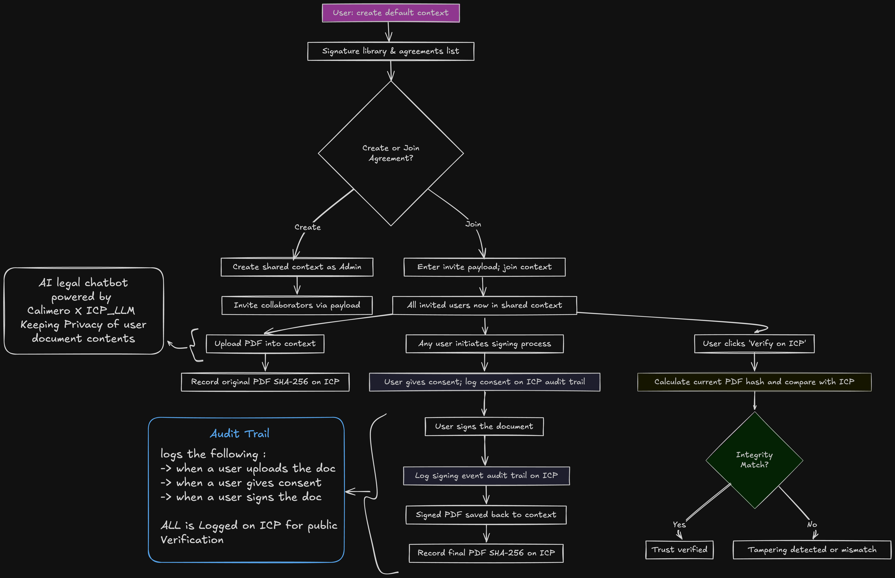
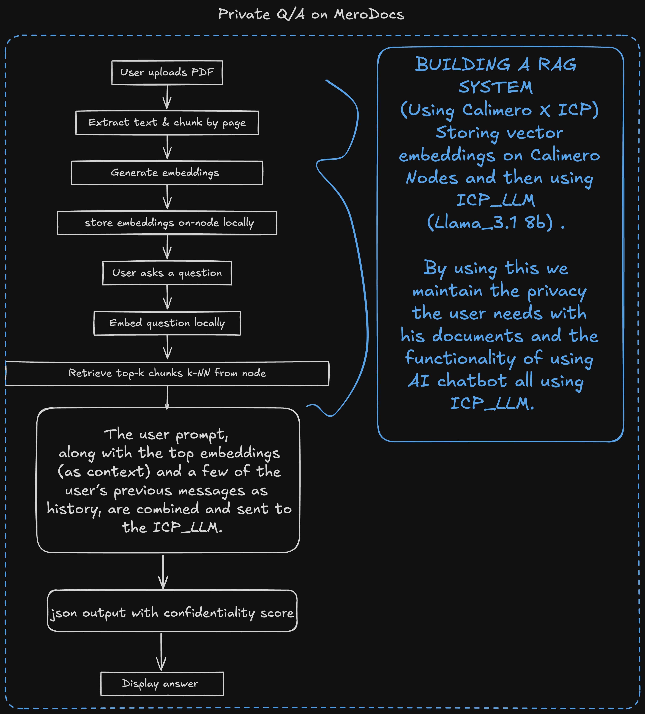

# MeroDocs

**MeroDocs** is a privacy-first e-signature platform built on **Calimero**.  
It empowers users on independent nodes to securely collaborate and sign PDF contracts peer-to-peer,  
all without centralized servers or intermediaries.

---

## Live Application

🔗 [MeroDocs App](https://mero-docs.vercel.app)

---

## Project Overview & Current Status

### Default Context (User’s Private Workspace)

- Each user creates a **private default context** on their node.
- This context stores:
  - The user’s **signature library**
  - A list of **agreements** (shared contexts) the user belongs to

### Creating or Joining Agreements

- **Create Agreement**: A user creates a new shared context and becomes the Admin.
- **Invite Collaborators**: The Admin generates an **invite payload** using other participants’ Calimero identity and assigns permissions (view/sign).
- **Join Agreement**: A user on a different node enters the invite payload and names the agreement on their node.

### Shared Context Workflow

- Multiple users across nodes join a **shared context**.
- Within the shared agreement:
  - Users **upload PDFs**
  - Members can **view or sign**, according to their permissions
  - Access remains restricted to invited participants—**no third parties have access**

### Signature Library

Each user can maintain a **personal signature library** within their private default context. This feature allows users to:

- **Create and Store Signatures**: Users can draw their digital signatures securely within their private workspace
- **Reuse Signatures**: Once created, signatures can be applied to multiple documents without recreating them
- **Privacy-First Storage**: All signatures remain stored locally on the user's node—never exposed to external parties
- **Quick Access**: Stored signatures are readily available when signing documents, streamlining the signing process

The signature library ensures both convenience and security, allowing users to maintain consistent digital signatures while preserving complete privacy and control over their signing credentials.

### PDF Upload & Signing

- When a PDF is uploaded to the context, it is stored securely within the Calimero node
- After signing:
  - The **signed PDF** is saved back into the context
  - All documents remain encrypted and private within the user's Calimero context
- Document verification and integrity features will be available with future Calimero-based implementations

### AI Legal Chatbot

An AI-powered legal chatbot feature is planned for future implementation using Calimero-based services. This feature will:

- Generate embeddings for uploaded documents and store them securely on the Calimero node
- Provide document analysis, question-answering, and summarization capabilities
- Maintain complete privacy by processing data locally on Calimero nodes
- Ensure all document content remains encrypted and never exposed to external parties

_Note: This feature is currently under development and will be available in a future release._

### Audit Trail

An audit trail feature for tracking user actions is planned for future implementation using Calimero-based services. This will provide:

- **Document Upload Tracking**: Record when documents are uploaded to a context
- **User Consent Logging**: Track explicit consent given before document signing
- **Signing Event Recording**: Log signing events with timestamps and user identities

_Note: This feature is currently under development and will be available in a future release._

---

## Workflow Flowchart

<p align="center">
  
</p>
<p align="center">
  
</p>

---

## Features Overview

| Feature                    | Description                                                                        |
| -------------------------- | ---------------------------------------------------------------------------------- |
| Private Context            | Local workspace per user for signature library and agreement list.                 |
| Agreement Creation         | Create a shared context; you become its administrator.                             |
| Invitation System          | Generate secure invite payloads tied to Calimero identities with permissions.      |
| Join Agreement             | Input invite payload to create shared context on your node.                        |
| Collaborative PDF Workflow | Users upload, view, and sign PDFs based on assigned roles in context.              |
| Document Storage           | All documents stored securely and encrypted within Calimero contexts.              |
| Signature Library          | Personal signature library stored in user's private default context.               |
| AI Legal Chatbot           | _Coming soon_ - Privacy-preserving chatbot for document analysis (Calimero-based). |
| Audit Trail                | _Coming soon_ - Comprehensive audit logging (Calimero-based).                      |
| End‑to‑End Privacy         | Documents are never exposed outside Calimero if not explicitly shared.             |

---

## Tutorial: App Setup

### Logic

```bash title="Terminal"
cd logic
```

```bash title="Terminal"
chmod +x ./build.sh
```

```bash title="Terminal"
./build.sh
```

### Canister

For detailed canister setup and deployment, see `merodocs_registry/BUILD.md`.

Set up your environment variables as needed for your Calimero deployment.

---

### App

```bash title="Terminal"
cd app
```

```bash title="Terminal"
pnpm install
```

```bash title="Terminal"
pnpm build
```

```bash title="Terminal"
pnpm dev
```

Open the app in your browser and connect to your running node.

The app will be deployed and accessible at: [http://localhost:5173/](http://localhost:5173/)

---

### Initial Application Context Initialization

To initialize your application context, run:

```bash
cargo run -p meroctl -- --node nodeX context create --application-id <APP_ID> --params '{"is_private": true,"context_name": "default"}'
```

Replace `<APP_ID>`, `nodeX`, and other parameters as needed for your deployment.

---

## Technical Implementation Details

**Calimero-Based Contexts**

- User-specific default context stores local signatures and membership.
- Shared contexts are created or joined via invite payloads.
- All interactions (invite, upload, sign) use Calimero RPC and encryption.
- Documents are stored encrypted within Calimero contexts, ensuring complete privacy.

**Future Enhancements**

- Document verification and integrity features will be implemented using Calimero-based services
- AI Legal Chatbot will use Calimero-native AI services for document analysis
- Audit trail functionality will be built on Calimero's logging and verification capabilities

---

## Security & Privacy Assurance

- All documents remain encrypted within Calimero contexts.
- No files ever leave user nodes—complete end-to-end privacy.
- Access to documents is strictly permissioned, ensuring privacy and control.
- All data processing happens locally on Calimero nodes.
- Future AI features will maintain the same privacy-first approach, processing data entirely within Calimero infrastructure.

---
