# CI/CD Pipeline Setup for MeroDocs ICP Canister

This document explains how to set up and use the CI/CD pipeline for deploying your ICP canister.

## 🚀 Pipeline Overview

The pipeline uses a **single job** that builds and deploys the canister in one streamlined process.

### **Deployment Triggers**

- **Automatic**: Push git tags following semver pattern (e.g., `v1.0.0`, `v2.1.3`)
- **Manual**: Using GitHub Actions "Run workflow" button with options for:
  - Environment: `mainnet` or `local`
  - Cycles amount: Configurable (default: 1.0 trillion)

### **Release Process**

Create and push a git tag to trigger automatic deployment:

```bash
git tag v1.0.0
git push origin v1.0.0
```

### **Build and Deploy Process**

The pipeline performs these steps in sequence:

1. ✅ Sets up Rust toolchain with WASM32 target
2. ✅ Caches dependencies for faster builds
3. ✅ Installs dfx and candid-extractor tools
4. ✅ Configures identity (mainnet only)
5. ✅ Builds canister with dfx
6. ✅ Generates WASM and Candid interface
7. ✅ Deploys to target network
8. ✅ Outputs canister ID and URL

## 🔧 Setup Instructions

### 1. Generate DFX Identity for CI/CD

First, create a new identity specifically for deployments:

```bash
# Create a new identity
dfx identity new ci-deployment
dfx identity use ci-deployment

# Get the principal ID (you'll need this for cycles management)
dfx identity get-principal

# Export the identity to PEM format
dfx identity export ci-deployment > ci-identity.pem
```

### 2. Configure GitHub Secrets

Go to your GitHub repository → Settings → Secrets and Variables → Actions, and add:

#### Required Secrets:

- **`DFX_IDENTITY_PEM`**: Contents of the `ci-identity.pem` file you generated

> **Note**: This secret is only required for mainnet deployments. Local deployments use the default identity.

### 3. Fund Your Deployment Identity

Your deployment identity needs cycles to create and manage canisters:

```bash
# Switch to your funded identity
dfx identity use default  # or your main identity

# Transfer ICP to the deployment identity
dfx ledger transfer --amount 0.5 --to $(dfx identity get-principal ci-deployment)

# Convert ICP to cycles (using deployment identity)
dfx identity use ci-deployment
dfx cycles convert --amount 0.4
```

## 📋 Usage

### Creating a Release

1. **Make your changes** and commit them to your branch
2. **Merge to main/master** branch
3. **Create and push a version tag**:
   ```bash
   git checkout master
   git pull origin master
   git tag v1.0.0  # Use semantic versioning
   git push origin v1.0.0
   ```

The pipeline will automatically:

- Build the canister for WASM32 target
- Generate Candid interface
- Deploy to ICP mainnet with 1T cycles (default)
- Provide canister ID and URL in the GitHub Actions summary

### Manual Deployment

You can trigger deployments manually with custom options:

1. Go to GitHub → Actions tab
2. Select "Deploy ICP Canister" workflow
3. Click "Run workflow"
4. Configure options:
   - **Environment**: Choose `mainnet` or `local`
   - **Cycles**: Specify amount in trillions (e.g., `1.5` for 1.5T cycles)
5. Click "Run workflow"

The pipeline will build and deploy to your chosen environment with the specified cycles allocation.

### Testing Before Release

Before creating a release tag, test locally:

```bash
cd merodocs_registry
./test-deployment.sh
```

This script will:

- Check prerequisites
- Build the canister locally
- Deploy to local dfx instance
- Provide testing URLs

## 📊 Pipeline Workflow

The simplified workflow runs as a single job:

```mermaid
graph TD
    A[Push Tag v*.*.*] --> B[Build and Deploy Job]
    C[Manual Trigger] --> B
    
    B --> D[Setup Rust + Tools]
    D --> E[Configure Identity]
    E --> F[Build Canister]
    F --> G[Deploy to Network]
    G --> H[Output URLs]
    
    H --> I[✅ Success]
    
    style B fill:#e1f5fe
    style I fill:#c8e6c9
```



**Key Features:**
- Single job execution (faster, simpler)
- Network-aware deployment (local vs mainnet)
- Configurable cycles allocation
- Automatic cleanup for local deployments

## 🔍 Monitoring Deployments

After deployment, you can monitor your canister:

### Canister URLs:

- **Main Interface**: `https://{CANISTER_ID}.icp0.io`
- **Candid UI**: `https://a4gq6-oaaaa-aaaab-qaa4q-cai.raw.icp0.io/?id={CANISTER_ID}`

### Useful dfx Commands:

```bash
# Check canister status
dfx canister --network ic status backend

# View canister info
dfx canister --network ic info backend

# Check cycles balance
dfx canister --network ic status backend --with-cycles
```

## 🛠 Troubleshooting

### Common Issues:

**Pipeline fails with "insufficient cycles":**
- Fund your deployment identity with more ICP/cycles
- Increase cycles amount in manual deployment
- Check: `dfx wallet --network ic balance`

**Build fails:**
- Check Rust version compatibility (currently: v1.89.0)
- Ensure dfx version matches (currently: v0.28.0)
- Test locally: `dfx build` in the merodocs_registry directory

**Identity issues:**
- Regenerate the identity PEM and update the GitHub secret
- Ensure the identity has sufficient cycles for mainnet deployment
- Local deployments don't require identity setup

**Local deployment issues:**
- Ensure dfx is not already running locally
- Pipeline automatically manages local dfx lifecycle

### Pipeline-Specific Issues:

**"bc: command not found":**
- This is handled automatically in the pipeline (basic calculator for cycles conversion)

**Tool installation failures:**
- Pipeline uses official installers for dfx and cargo tools
- Check GitHub Actions logs for specific tool installation errors

### Getting Help:

1. Check the GitHub Actions logs for detailed error messages
2. Test the deployment locally: `dfx build && dfx deploy`
3. Verify your dfx version: `dfx --version` (should be 0.28.0)
4. For local testing, ensure no other dfx instances are running

## 📈 Pipeline Features

### Current Features:
- ✅ Single job execution (fast and simple)
- ✅ Network switching (local vs mainnet)
- ✅ Configurable cycles allocation
- ✅ Automatic identity management
- ✅ Dependency caching for faster builds
- ✅ Official dfx installer usage
- ✅ Automatic cleanup for local deployments

### Architecture Benefits:
- **Simplified**: One job instead of multiple complex jobs
- **Fast**: Cached dependencies and streamlined process
- **Reliable**: Uses official tools and minimal dependencies
- **Flexible**: Manual deployment with custom parameters
